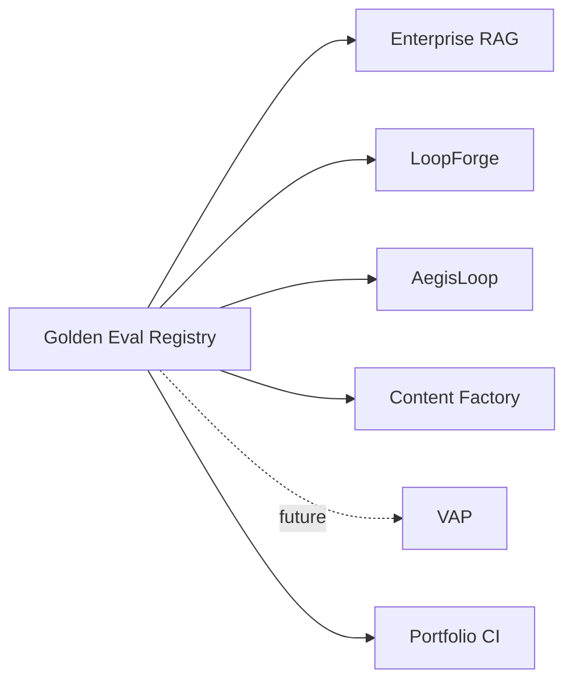

# Golden Eval Registry — Architecture

## System role

Golden Eval Registry is the **evaluation contract layer** for the vpeetla-ai stack. It does not replace each repo's local tests; it versions the fixtures and thresholds those repos can import.



## Design principles

| Principle | Implementation |
|-----------|----------------|
| Versioned fixtures | Suite folders named `*_v1` with manifest version |
| Locked evals | `locked: true`; agents must not mutate golden data |
| No live services | Validator only checks fixture shape and local health |
| Consumer-owned execution | Each platform owns how it runs the cases |

## Request path

```text
Repo CI
  -> fetch/import suite
  -> map case.kind to local runner
  -> execute local deterministic test path
  -> publish report / badge
```

## Extension points

| Area | v1 | Future |
|------|----|--------|
| Schema | Python stdlib validator | JSON Schema export |
| Execution | Fixture validation | Cross-repo GitHub Actions matrix |
| Reports | CLI summary | Markdown and badge artifacts |
| Consumers | 5 suite families | VAP router evals, pattern trace schemas |

## Non-goals

- No shared production secrets
- No live LLM calls
- No mutation of consumer repos
- No replacement for repo-local pytest suites
