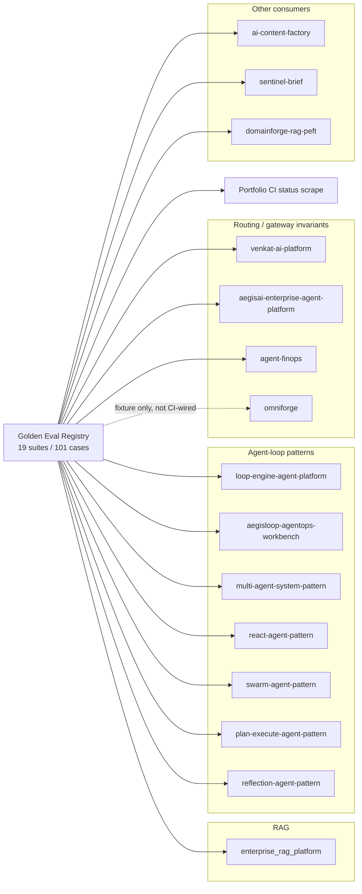

# Golden Eval Registry — Architecture

## System role

Golden Eval Registry is the **evaluation contract layer** for the vpeetla-ai stack. It does not replace each repo's local tests; it versions the fixtures and thresholds those repos can import.


```mermaid
flowchart LR
  Registry["Golden Eval Registry<br/>19 suites / 101 cases"]

  subgraph RAG["RAG"]
    ERAG["enterprise_rag_platform"]
  end

  subgraph Agentic["Agent-loop patterns"]
    LF["loop-engine-agent-platform"]
    AL["aegisloop-agentops-workbench"]
    MAS["multi-agent-system-pattern"]
    RAP["react-agent-pattern"]
    SAP["swarm-agent-pattern"]
    PEP["plan-execute-agent-pattern"]
    RFP["reflection-agent-pattern"]
  end

  subgraph Routing["Routing / gateway invariants"]
    VAP["venkat-ai-platform"]
    AEG["aegisai-enterprise-agent-platform"]
    FIN["agent-finops"]
    OMN["omniforge"]
  end

  subgraph Other["Other consumers"]
    ACF["ai-content-factory"]
    SB["sentinel-brief"]
    DF["domainforge-rag-peft"]
  end

  PF["Portfolio CI status scrape"]

  Registry --> ERAG
  Registry --> LF
  Registry --> AL
  Registry --> MAS
  Registry --> RAP
  Registry --> SAP
  Registry --> PEP
  Registry --> RFP
  Registry --> VAP
  Registry --> AEG
  Registry --> FIN
  Registry -. fixture only, not CI-wired .-> OMN
  Registry --> ACF
  Registry --> SB
  Registry --> DF
  Registry --> PF
```

Every edge above is a real `consumer_repos` entry read directly from a
`suites/*/manifest.json` in this repo (19 suites total, confirmed against
`registry.json`), not inferred from prose. `omniforge` is drawn as a dotted
edge because `omniforge.routing_outcome_v1` (kind `mission_gate`, `manifest.json`
declares `consumer_repos: ["omniforge"]`) exists as a real fixture in this
registry, but `omniforge`'s own `.github/workflows/ci.yml` does not check this
repo out or run the suite — it is not yet a live CI gate the way the
`aegisloop-agentops-workbench` and `multi-agent-system-pattern` mission-gate
suites are (see the README's Suite kinds table).

## Design principles

| Principle | Implementation |
|-----------|----------------|
| Versioned fixtures | Suite folders named `*_v1` with manifest version |
| Locked evals | `locked: true`; agents must not mutate golden data |
| No live services | Validator only checks fixture shape and local health |
| Consumer-owned execution | Each platform owns how it runs the cases |

## Request path

```text
Repo CI
  -> fetch/import suite
  -> map case.kind to local runner
  -> execute local deterministic test path
  -> publish report / badge
```

## Extension points

| Area | v1 | Future |
|------|----|--------|
| Schema | Python stdlib validator | JSON Schema export |
| Execution | Fixture validation | Cross-repo GitHub Actions matrix |
| Reports | CLI summary | Markdown and badge artifacts |
| Consumers | 19 suites / 11 kinds across 14 consumer repos (see README's Suite kinds table for the current, authoritative list) | — |
| Honesty scrape | `scripts/scrape_status_tables.py` — status sections + `observability/status` on spine/AgentOps/LLM-plane READMEs | Overnight JSON artifact already supported |

I’d rather fail a scrape when a README goes quiet on compose honesty than discover it in a panel. GER itself stays a library — no live `/observability/status` service here.

## Non-goals

- No shared production secrets
- No live LLM calls
- No mutation of consumer repos
- No replacement for repo-local pytest suites
